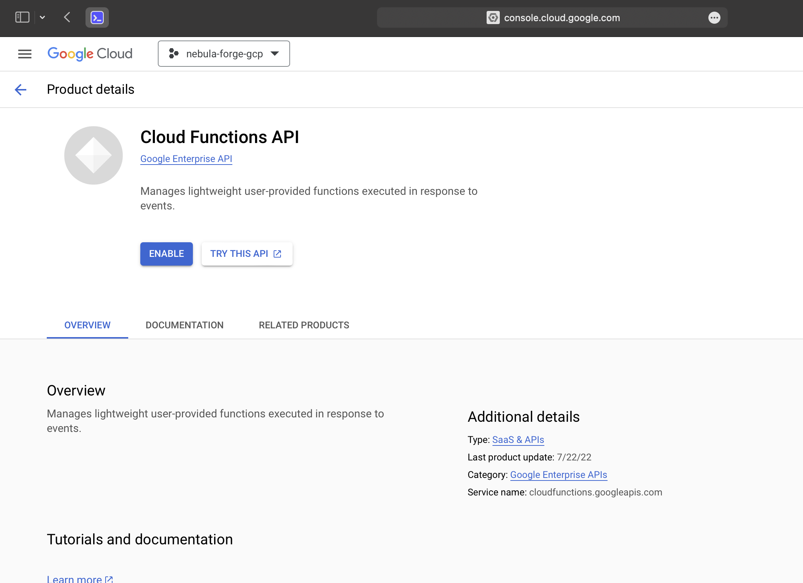
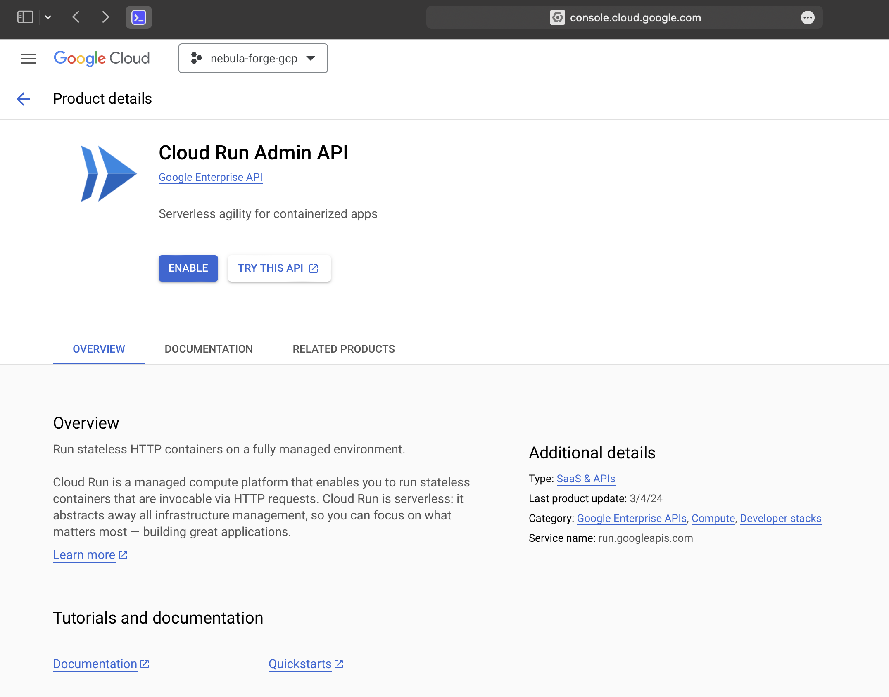
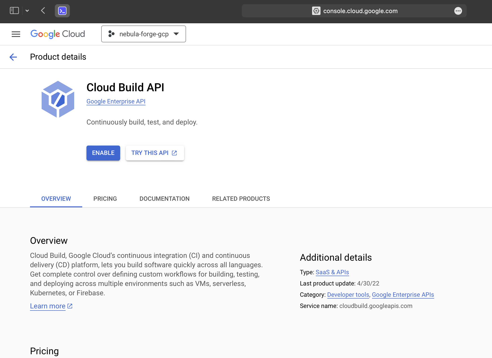
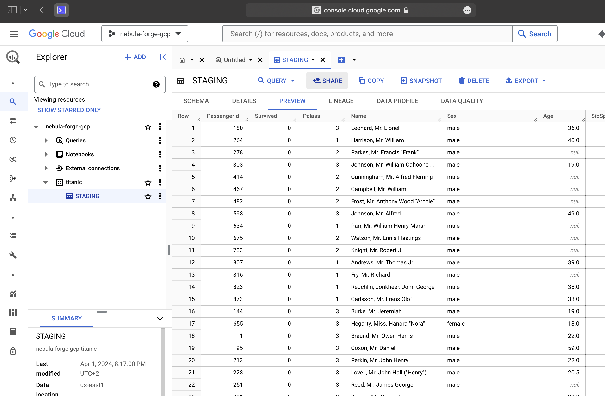
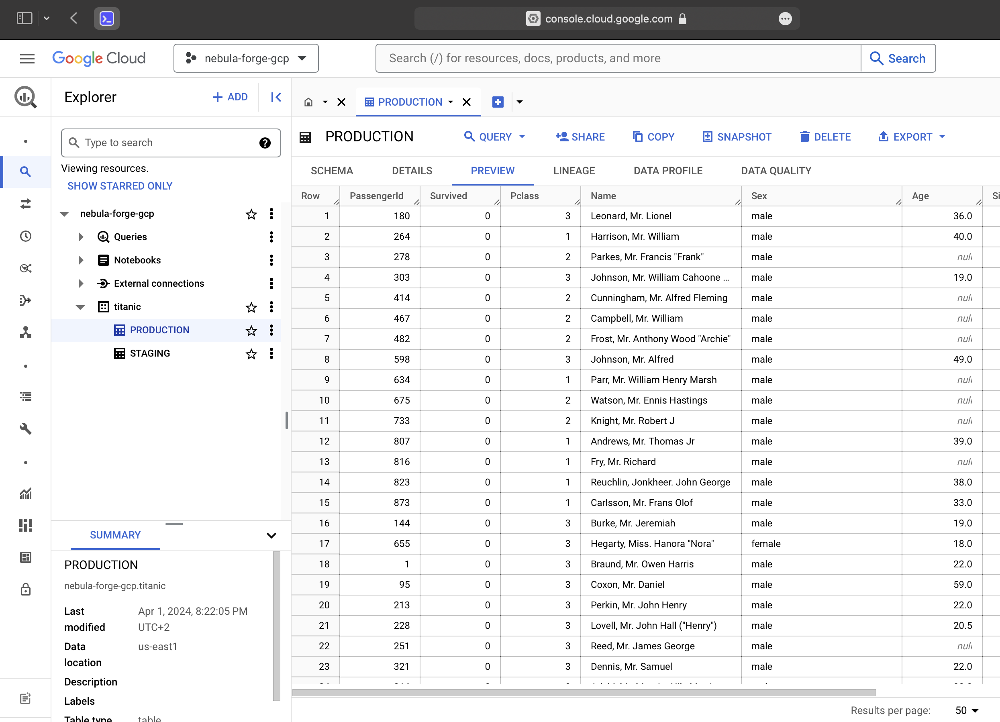

## Prerequisite

Ensure that the **gcloud CLI** is configured and ready to work with GCP. For additional information, refer to the [documentation](https://cloud.google.com/sdk/docs/install).

---

Create the GCP project. For additional information, refer to the [documentation](https://developers.google.com/workspace/guides/create-project#gcloud-cli)
```
gcloud projects create <PROJECT_ID>
```
Example:
```
> gcloud projects create club-innocent-gcp
Create in progress for [https://cloudresourcemanager.googleapis.com/v1/projects/club-innocent-gcp].
Waiting for [operations/cp.6637409983386203609] to finish...done.                                                                                
Enabling service [cloudapis.googleapis.com] on project [club-innocent-gcp]...
Operation "operations/acat.p2-934351443631-12b951f8-9e3f-44a5-a188-fc01ab008f6c" finished successfully.

> gcloud projects list
PROJECT_ID        NAME              PROJECT_NUMBER
club-innocent-gcp  club-innocent-gcp  934851******
```

---

Activate the billing account for the project. For more information, see this [help](https://support.google.com/googleapi/answer/6158867?hl=en) page.

---

Activate the following APIs for the project:
* Cloud Functions API 
* Cloud Run Admin API
* Cloud Build API

These APIs are mandatory to run functions in GCP. For more information, see the [documentation](https://cloud.google.com/service-usage/docs/enable-disable).




---

Ensure that the **gcloud CLI** is authorized and ready to work with the created project. For additional information, refer to the [documentation](https://cloud.google.com/sdk/docs/initializing).
```
gcloud init
```

---

Ensure that the **Terrafrom CLI** is installed. For more information, see the [documentation](https://developer.hashicorp.com/terraform/tutorials/aws-get-started/install-cli)

## Deploy GCP resources using Terraform

To deploy resources, run the next commands:
```
terraform init
terraform apply
```

Example:
```
> terraform init

Initializing the backend...
Initializing modules...

Initializing provider plugins...
- Reusing previous version of hashicorp/archive from the dependency lock file
- Reusing previous version of hashicorp/google from the dependency lock file
- Reusing previous version of hashicorp/random from the dependency lock file
- Using previously-installed hashicorp/archive v2.4.2
- Using previously-installed hashicorp/google v5.22.0
- Using previously-installed hashicorp/random v3.6.0

Terraform has been successfully initialized!

You may now begin working with Terraform. Try running "terraform plan" to see
any changes that are required for your infrastructure. All Terraform commands
should now work.

If you ever set or change modules or backend configuration for Terraform,
rerun this command to reinitialize your working directory. If you forget, other
commands will detect it and remind you to do so if necessary.

> terraform apply
var.project_id
  Enter a value: club-innocent-gcp

var.project_name
  Enter a value: club-innocent-gcp

var.region
  Enter a value: us-east1

...

Do you want to perform these actions?
  Terraform will perform the actions described above.
  Only 'yes' will be accepted to approve.

  Enter a value: yes

module.upload_function.random_pet.this: Creating...
module.raw_data.random_pet.this: Creating...
module.upload_function.random_pet.this: Creation complete after 0s [id=immune-cod]
module.raw_data.random_pet.this: Creation complete after 0s [id=eternal-cockatoo]
module.upload_function.google_service_account.this: Creating...
module.big_query.google_bigquery_dataset.this: Creating...
module.upload_function.google_storage_bucket.this: Creating...
module.raw_data.google_storage_bucket.this: Creating...
module.big_query.google_bigquery_dataset.this: Creation complete after 1s [id=projects/club-innocent-gcp/datasets/titanic]
module.upload_function.google_storage_bucket.this: Creation complete after 2s [id=club-innocent-gcp-immune-cod-artifacts]
module.upload_function.google_storage_bucket_object.this: Creating...
module.raw_data.google_storage_bucket.this: Creation complete after 2s [id=club-innocent-gcp-eternal-cockatoo-data]
module.raw_data.google_storage_bucket_object.this: Creating...
module.upload_function.google_service_account.this: Creation complete after 2s [id=projects/club-innocent-gcp/serviceAccounts/club-innocent-gcp-gcf-sa@club-innocent-gcp.iam.gserviceaccount.com]
module.upload_function.google_project_iam_binding.bigquery-data-editor: Creating...
module.upload_function.google_project_iam_binding.cloud-run-invoker: Creating...
module.upload_function.google_project_iam_binding.bigquery-job-user: Creating...
module.upload_function.google_project_iam_binding.storage-object-viewer: Creating...
module.raw_data.google_storage_bucket_object.this: Creation complete after 1s [id=club-innocent-gcp-eternal-cockatoo-data-titanic.parquet]
module.upload_function.google_storage_bucket_object.this: Creation complete after 2s [id=club-innocent-gcp-immune-cod-artifacts-upload-from-gs-to-bigquery.f7054aa91a3f81ec365ee1751c6648cd280298758ec739ea6b5824b72e11be90.zip]
module.upload_function.google_cloudfunctions2_function.this: Creating...
module.upload_function.google_project_iam_binding.storage-object-viewer: Creation complete after 10s [id=club-innocent-gcp/roles/storage.objectViewer]
module.upload_function.google_project_iam_binding.bigquery-job-user: Still creating... [10s elapsed]
module.upload_function.google_project_iam_binding.bigquery-data-editor: Still creating... [10s elapsed]
module.upload_function.google_project_iam_binding.cloud-run-invoker: Still creating... [10s elapsed]
module.upload_function.google_project_iam_binding.bigquery-data-editor: Creation complete after 10s [id=club-innocent-gcp/roles/bigquery.dataEditor]
module.upload_function.google_project_iam_binding.bigquery-job-user: Creation complete after 11s [id=club-innocent-gcp/roles/bigquery.jobUser]
module.upload_function.google_project_iam_binding.cloud-run-invoker: Creation complete after 11s [id=club-innocent-gcp/roles/run.invoker]
module.upload_function.google_cloudfunctions2_function.this: Still creating... [10s elapsed]
module.upload_function.google_cloudfunctions2_function.this: Still creating... [20s elapsed]
module.upload_function.google_cloudfunctions2_function.this: Still creating... [30s elapsed]
module.upload_function.google_cloudfunctions2_function.this: Still creating... [40s elapsed]
module.upload_function.google_cloudfunctions2_function.this: Still creating... [50s elapsed]
module.upload_function.google_cloudfunctions2_function.this: Still creating... [1m0s elapsed]
module.upload_function.google_cloudfunctions2_function.this: Still creating... [1m10s elapsed]
module.upload_function.google_cloudfunctions2_function.this: Still creating... [1m20s elapsed]
module.upload_function.google_cloudfunctions2_function.this: Creation complete after 1m27s [id=projects/club-innocent-gcp/locations/us-east1/functions/club-innocent-gcp-upload-from-gs-to-bigquery]

Apply complete! Resources: 13 added, 0 changed, 0 destroyed.

Outputs:

raw_data_bucket_url = "gs://club-innocent-gcp-eternal-cockatoo-data"
raw_data_object_url = "gs://club-innocent-gcp-eternal-cockatoo-data/titanic.parquet"
upload_function_url = "https://club-innocent-gcp-upload-from-gs-to-bigquery-57f5******-ue.a.run.app"
```

The terraform template returns 3 variables:
* **raw_data_bucket_url** - the URL of the bucket where the raw data is stored
* **raw_data_object_url** - the URL of the object that holds the raw data
* **upload_function_url** - the URL of the Cloud Function that loads the raw data into the BigQuery table

## Upload raw data to the STAGING table

To upload the raw data to the STAGING table, invoke the deploy Cloud Function via cURL:
```
curl -X POST <CLOUD_FUNCTION_URL> \
-H "Authorization: bearer $(gcloud auth print-identity-token)" \
-H "Content-Type: application/json" \
-d '{
  "gc_url": "<RAW_DATA_GC_URL>",
  "table": "<TABLE NAME>"
}'
```

Example:
```
> curl -X POST https://club-innocent-gcp-upload-from-gs-to-bigquery-57f5dydquq-ue.a.run.app \
-H "Authorization: bearer $(gcloud auth print-identity-token)" \
-H "Content-Type: application/json" \
-d '{
  "gc_url": "gs://club-innocent-gcp-eternal-cockatoo-data/titanic.parquet",
  "table": "STAGING"
}'

Loaded 891 rows.%                    
```

You can use BigQuery Studio to see the imported data:


## Push data from STAGING to PRODUCTION tables

To push data from the STAGING table to the PRODUCTION table, use the next **bq CLI** command:
```
bq cp -f <DATASET_ID>.<SOURCE_TABLE> <DATASET_ID>.<TARGET_TABLE>
```

Example:
```
> bq cp -f titanic.STAGING titanic.PRODUCTION
Waiting on bqjob_r16f037f4594e21e7_0000018e9ae5a2fd_1 ... (0s) Current status: DONE   
Table 'club-innocent-gcp:titanic.STAGING' successfully copied to 'club-innocent-gcp:titanic.PRODUCTION'
```
